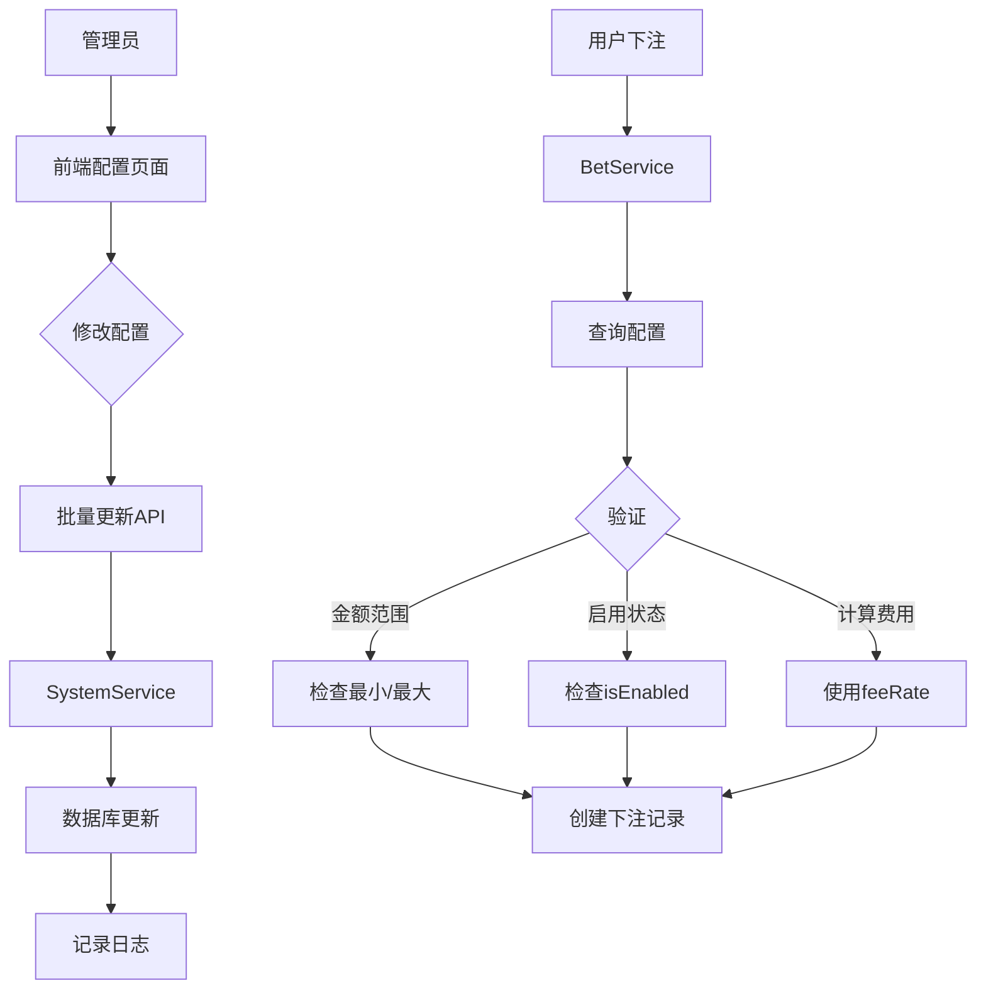

# 🎯 下注类型配置系统实施计划

## 📋 需求描述

根据图片显示，需要为每种下注类型配置以下参数：

### 下注类型列表
1. **单** - 结果为单数
2. **双** - 结果为双数  
3. **大** - 结果 ≥ 14
4. **小** - 结果 < 14
5. **大单** - 结果 ≥ 14 且为单数
6. **大双** - 结果 ≥ 14 且为双数
7. **小单** - 结果 < 14 且为单数
8. **小双** - 结果 < 14 且为双数
9. **倍数** - 按倍数下注（2倍、3倍、5倍等）

### 每种类型需要配置的参数
- **赔率** - 中奖赔率（如1.95倍、3.80倍）
- **最小投注额** - 单次最小下注金额
- **最大投注额** - 单次最大下注金额
- **手续费比例** - 扣除的手续费百分比
- **退水比例** - 返还给用户的比例（类似佣金）
- **是否启用** - 开关此玩法

---

## ✅ 已完成的工作

### 1. 数据库设计 ✅

**创建了新表 `bet_type_settings`：**
```sql
CREATE TABLE `bet_type_settings` (
  `id` INT AUTO_INCREMENT PRIMARY KEY,
  `bet_type` VARCHAR(50) UNIQUE NOT NULL,     -- 类型标识
  `name` VARCHAR(100) NOT NULL,                -- 显示名称
  `odds` DECIMAL(10, 2) DEFAULT 0.00,         -- 赔率
  `min_bet` DECIMAL(10, 2) DEFAULT 1.00,      -- 最小投注
  `max_bet` DECIMAL(10, 2) DEFAULT 10000.00,  -- 最大投注
  `fee_rate` DECIMAL(10, 4) DEFAULT 0.0000,   -- 手续费比例
  `rebate_rate` DECIMAL(10, 4) DEFAULT 0.0000, -- 退水比例
  `is_enabled` TINYINT(1) DEFAULT 1,           -- 是否启用
  `sort_order` INT DEFAULT 0,                  -- 排序
  `description` VARCHAR(500),                   -- 说明
  `created_at` DATETIME DEFAULT CURRENT_TIMESTAMP,
  `updated_at` DATETIME DEFAULT CURRENT_TIMESTAMP ON UPDATE CURRENT_TIMESTAMP
);
```

**默认数据（根据图片）：**
```sql
INSERT INTO `bet_type_settings` VALUES
('single', '单', 1.95, 1.00, 4999.00, 0.00, 0.00, 1, 1, '结果为单数'),
('double', '双', 1.95, 1.00, 4999.00, 0.00, 0.00, 1, 2, '结果为双数'),
('big', '大', 1.95, 1.00, 4999.00, 0.00, 0.00, 1, 3, '结果>=14'),
('small', '小', 1.95, 1.00, 4999.00, 0.00, 0.00, 1, 4, '结果<14'),
('big_single', '大单', 3.80, 7.00, 1000.00, 0.00, 0.00, 1, 5, '>=14且单'),
('big_double', '大双', 3.80, 19.50, 1000.00, 0.00, 0.00, 1, 6, '>=14且双'),
('small_single', '小单', 3.80, 7.00, 1000.00, 0.00, 0.00, 1, 7, '<14且单'),
('small_double', '小双', 3.80, 0.00, 1000.00, 0.00, 0.00, 1, 8, '<14且双');
```

### 2. Prisma Schema 更新 ✅

```prisma
model BetTypeSetting {
  id            Int      @id @default(autoincrement())
  betType       String   @unique @map("bet_type")
  name          String
  odds          Decimal  @default(0) @db.Decimal(10, 2)
  minBet        Decimal  @map("min_bet") @default(1)
  maxBet        Decimal  @map("max_bet") @default(10000)
  feeRate       Decimal  @map("fee_rate") @default(0)
  rebateRate    Decimal  @map("rebate_rate") @default(0)
  isEnabled     Boolean  @default(true) @map("is_enabled")
  sortOrder     Int      @default(0) @map("sort_order")
  description   String?
  createdAt     DateTime @default(now()) @map("created_at")
  updatedAt     DateTime @updatedAt @map("updated_at")
  
  @@map("bet_type_settings")
}
```

### 3. DTO 定义 ✅

**文件：** `backend/src/modules/system/dto/bet-type-setting.dto.ts`

```typescript
export class UpdateBetTypeSettingDto {
  name?: string;           // 显示名称
  odds?: number;           // 赔率
  minBet?: number;         // 最小投注
  maxBet?: number;         // 最大投注
  feeRate?: number;        // 手续费比例
  rebateRate?: number;     // 退水比例
  isEnabled?: boolean;     // 是否启用
  sortOrder?: number;      // 排序
  description?: string;    // 说明
}

export class BatchUpdateBetTypeSettingsDto {
  settings: Array<{betType: string} & UpdateBetTypeSettingDto>;
}
```

### 4. API 接口 ✅

**文件：** `backend/src/modules/system/system.controller.ts`

| 接口 | 方法 | 说明 |
|------|------|------|
| `/admin/bet-type-settings` | GET | 获取所有下注类型配置 |
| `/admin/bet-type-settings/:betType` | GET | 获取指定类型配置 |
| `/admin/bet-type-settings/:betType` | PUT | 更新指定类型配置 |
| `/admin/bet-type-settings/batch` | POST | 批量更新配置 |

---

## 🚧 待完成的工作

### 1. 服务层实现 ⏰

**文件：** `backend/src/modules/system/system.service.ts`

需要添加以下方法：

```typescript
export class SystemService {
  // 获取所有下注类型配置
  async getBetTypeSettings() {
    return await this.prisma.betTypeSetting.findMany({
      orderBy: { sortOrder: 'asc' }
    });
  }

  // 获取指定下注类型配置
  async getBetTypeSetting(betType: string) {
    return await this.prisma.betTypeSetting.findUnique({
      where: { betType }
    });
  }

  // 更新指定下注类型配置
  async updateBetTypeSetting(
    betType: string,
    updateDto: UpdateBetTypeSettingDto,
    adminId: number,
    adminUsername: string
  ) {
    // 1. 更新配置
    const updated = await this.prisma.betTypeSetting.update({
      where: { betType },
      data: updateDto
    });

    // 2. 记录日志
    await this.logAction(
      adminId,
      adminUsername,
      'update_bet_type_setting',
      'bet_type_setting',
      betType,
      `更新下注类型配置: ${betType}`,
      updateDto
    );

    return updated;
  }

  // 批量更新
  async batchUpdateBetTypeSettings(
    batchUpdateDto: BatchUpdateBetTypeSettingsDto,
    adminId: number,
    adminUsername: string
  ) {
    const results = [];
    
    for (const item of batchUpdateDto.settings) {
      const { betType, ...updateData } = item;
      const updated = await this.updateBetTypeSetting(
        betType,
        updateData,
        adminId,
        adminUsername
      );
      results.push(updated);
    }

    return results;
  }
}
```

### 2. 数据库迁移 ⏰

```bash
# 方案 1：使用 Prisma 迁移
cd score-system/backend
npx prisma migrate dev --name add_bet_type_settings

# 方案 2：手动执行 SQL
mysql -u root -p yunce_score_system < prisma/migrations/add_bet_type_settings.sql
```

### 3. 前端页面开发 ⏰

**文件：** `frontend-admin/src/views/BetTypeSettings.vue`

**页面功能：**
- 列表展示所有下注类型配置
- 可编辑每项配置
- 支持批量保存
- 显示赔率、最小/最大投注额、手续费、退水比例
- 可启用/禁用某个玩法

**页面布局：**
```vue
<template>
  <div class="bet-type-settings">
    <el-card>
      <template #header>
        <div class="card-header">
          <span>下注类型配置</span>
          <el-button type="primary" @click="handleSave">保存配置</el-button>
        </div>
      </template>

      <el-table :data="settingsList" border>
        <el-table-column prop="name" label="类型名称" width="100" />
        <el-table-column label="赔率" width="120">
          <template #default="{ row }">
            <el-input-number
              v-model="row.odds"
              :min="0"
              :precision="2"
              size="small"
            />
          </template>
        </el-table-column>
        <el-table-column label="最小投注" width="150">
          <template #default="{ row }">
            <el-input-number
              v-model="row.minBet"
              :min="0"
              :precision="2"
              size="small"
            />
          </template>
        </el-table-column>
        <el-table-column label="最大投注" width="150">
          <template #default="{ row }">
            <el-input-number
              v-model="row.maxBet"
              :min="0"
              :precision="2"
              size="small"
            />
          </template>
        </el-table-column>
        <el-table-column label="手续费%" width="120">
          <template #default="{ row }">
            <el-input-number
              v-model="row.feeRate"
              :min="0"
              :max="100"
              :precision="2"
              size="small"
            />
          </template>
        </el-table-column>
        <el-table-column label="退水%" width="120">
          <template #default="{ row }">
            <el-input-number
              v-model="row.rebateRate"
              :min="0"
              :max="100"
              :precision="2"
              size="small"
            />
          </template>
        </el-table-column>
        <el-table-column label="启用状态" width="100">
          <template #default="{ row }">
            <el-switch v-model="row.isEnabled" />
          </template>
        </el-table-column>
        <el-table-column prop="description" label="说明" />
      </el-table>
    </el-card>
  </div>
</template>
```

### 4. API 客户端 ⏰

**文件：** `frontend-admin/src/api/settings.ts`

```typescript
// 获取所有下注类型配置
export function getBetTypeSettings() {
  return request.get('/admin/bet-type-settings')
}

// 更新指定下注类型配置
export function updateBetTypeSetting(betType: string, data: any) {
  return request.put(`/admin/bet-type-settings/${betType}`, data)
}

// 批量更新下注类型配置
export function batchUpdateBetTypeSettings(settings: any[]) {
  return request.post('/admin/bet-type-settings/batch', { settings })
}
```

### 5. 路由配置 ⏰

**文件：** `frontend-admin/src/router/index.ts`

```typescript
{
  path: '/bet-type-settings',
  name: 'BetTypeSettings',
  component: () => import('@/views/BetTypeSettings.vue'),
  meta: { title: '模式设置', requiresAuth: true, role: 'admin' }
}
```

### 6. 下注验证集成 ⏰

**文件：** `backend/src/modules/bet/bet.service.ts`

在创建下注时，需要验证：

```typescript
async createBet(userId: number, createBetDto: CreateBetDto) {
  // 获取该下注类型的配置
  const typeSetting = await this.prisma.betTypeSetting.findUnique({
    where: { betType: createBetDto.betContent }
  });

  // 验证是否启用
  if (!typeSetting || !typeSetting.isEnabled) {
    throw new BadRequestException('该下注类型暂不可用');
  }

  // 验证金额范围
  if (amount < typeSetting.minBet) {
    throw new BadRequestException(
      `下注金额不能少于${typeSetting.minBet}`
    );
  }
  if (amount > typeSetting.maxBet) {
    throw new BadRequestException(
      `下注金额不能超过${typeSetting.maxBet}`
    );
  }

  // 计算手续费（使用配置的费率）
  const fee = amount * typeSetting.feeRate;

  // 继续下注流程...
}
```

---

## 📊 数据流程图



---

## 🚀 部署步骤

### 第1步：数据库迁移
```bash
cd score-system/backend
npx prisma migrate dev --name add_bet_type_settings
# 或手动执行 SQL
```

### 第2步：重启后端
```bash
npm run start:dev
```

### 第3步：验证API
```bash
# 测试获取配置
curl http://localhost:3000/api/admin/bet-type-settings \
  -H "Authorization: Bearer YOUR_TOKEN"

# 测试更新配置
curl -X PUT http://localhost:3000/api/admin/bet-type-settings/single \
  -H "Authorization: Bearer YOUR_TOKEN" \
  -H "Content-Type: application/json" \
  -d '{"minBet": 2.00, "maxBet": 5000.00}'
```

### 第4步：前端开发
1. 创建 `BetTypeSettings.vue` 页面
2. 添加路由配置
3. 添加菜单项

### 第5步：测试
1. 配置各项参数
2. 前端下注验证
3. 手续费计算验证

---

## 📝 配置示例

### 示例1：单/双配置
```json
{
  "betType": "single",
  "name": "单",
  "odds": 1.95,
  "minBet": 1.00,
  "maxBet": 4999.00,
  "feeRate": 0.00,
  "rebateRate": 0.00,
  "isEnabled": true
}
```

### 示例2：大单配置（高赔率）
```json
{
  "betType": "big_single",
  "name": "大单",
  "odds": 3.80,
  "minBet": 7.00,
  "maxBet": 1000.00,
  "feeRate": 0.00,
  "rebateRate": 0.00,
  "isEnabled": true
}
```

### 示例3：倍数配置（有手续费）
```json
{
  "betType": "multiple_2",
  "name": "倍数 2倍",
  "odds": 2.00,
  "minBet": 1.00,
  "maxBet": 4999.00,
  "feeRate": 0.03,    // 3%手续费
  "rebateRate": 0.00,
  "isEnabled": true
}
```

---

## ✅ 验收标准

- [ ] 数据库表创建成功
- [ ] API 接口正常返回
- [ ] 前端页面可以查看配置
- [ ] 前端页面可以编辑配置
- [ ] 保存后立即生效
- [ ] 下注时验证最小/最大金额
- [ ] 下注时正确计算手续费
- [ ] 可以启用/禁用某个玩法
- [ ] 操作有日志记录

---

**当前进度：** 40% 完成

**下一步：** 实施服务层代码并执行数据库迁移

**更新时间：** 2025-11-27  
**版本：** v1.0  
**作者：** AI Assistant


