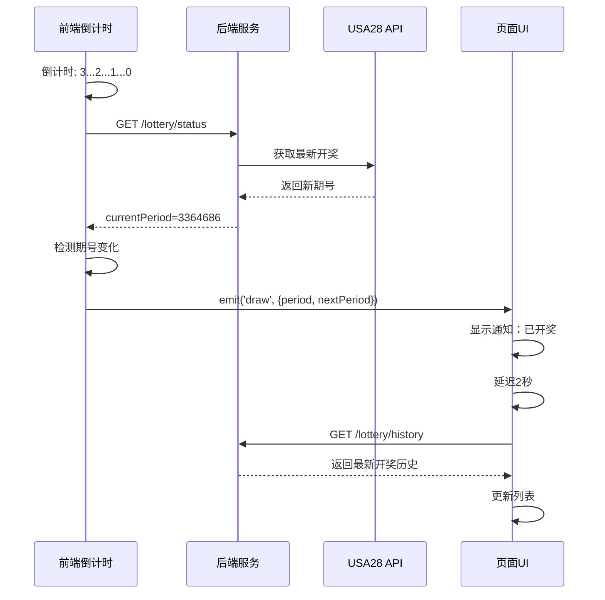

# 🔄 倒计时自动刷新开奖结果

## 📋 功能说明

当封盘倒计时结束（即开奖时刻），系统会自动刷新开奖历史，无需手动刷新。

---

## ⚙️ 实现原理

### 1. 后端定时同步

```typescript
// lottery-countdown.service.ts
@Cron(CronExpression.EVERY_MINUTE)
async syncLatestDraw() {
  await this.fetchLatestDraw(); // 每分钟从 USA28 获取最新开奖
}
```

### 2. 前端检测开奖

```typescript
// LotteryCountdown.vue
const handleDrawComplete = async () => {
  const oldPeriod = lotteryStatus.value?.currentPeriod
  
  // 重新同步服务器状态
  await fetchLotteryStatus()
  
  const newPeriod = lotteryStatus.value?.currentPeriod
  
  // 如果期号变化，说明已经开奖
  if (newPeriod && oldPeriod !== newPeriod) {
    console.log('🎰 开奖完成！')
    
    // 触发开奖事件
    emits('draw', {
      period: oldPeriod,
      nextPeriod: newPeriod,
    })
  }
}
```

### 3. 页面自动刷新

```vue
<template>
  <LotteryCountdown @draw="handleDraw" />
</template>

<script setup>
const handleDraw = (data) => {
  ElMessage.success(`第 ${data.period} 期已开奖`)
  
  // 延迟2秒刷新（确保后端数据已更新）
  setTimeout(() => {
    fetchLotteryHistory()
  }, 2000)
}
</script>
```

---

## 🔄 完整流程



---

## 📊 事件说明

### draw 事件（开奖完成）

**触发时机：** 倒计时结束且检测到期号变化

**参数：**
```typescript
{
  period: string      // 已开奖的期号
  nextPeriod: string  // 下一期期号
}
```

**用途：**
- 显示开奖通知
- 自动刷新开奖历史
- 更新统计数据
- 结算用户下注

---

### close 事件（封盘）

**触发时机：** 从开盘状态切换到封盘状态

**参数：**
```typescript
{
  period: string      // 当前期号
  nextPeriod: string  // 下期期号
}
```

**用途：**
- 禁用下注按钮
- 显示封盘提示
- 播放提示音

---

### open 事件（开盘）

**触发时机：** 从封盘状态切换到开盘状态

**参数：**
```typescript
{
  period: string      // 当前期号
  nextPeriod: string  // 下期期号
}
```

**用途：**
- 启用下注按钮
- 显示开盘提示
- 播放提示音

---

## 💡 使用示例

### 示例1：开奖历史页面

```vue
<template>
  <div class="lottery-history">
    <!-- 倒计时组件 -->
    <LotteryCountdown 
      @draw="handleDraw"
      @close="handleClose"
      @open="handleOpen"
    />

    <!-- 开奖列表 -->
    <el-table :data="lotteryList" />
  </div>
</template>

<script setup lang="ts">
import LotteryCountdown from '@/components/LotteryCountdown.vue'
import { getLotteryHistory } from '@/api/lottery'

const lotteryList = ref([])

const fetchLotteryHistory = async () => {
  const res = await getLotteryHistory({ page: 1, limit: 20 })
  lotteryList.value = res.data.list
}

// 开奖自动刷新
const handleDraw = (data) => {
  ElMessage.success(`第 ${data.period} 期已开奖`)
  setTimeout(() => fetchLotteryHistory(), 2000)
}

// 封盘处理
const handleClose = (data) => {
  console.log('封盘了，禁用下注')
}

// 开盘处理
const handleOpen = (data) => {
  console.log('开盘了，启用下注')
}

onMounted(() => {
  fetchLotteryHistory()
})
</script>
```

---

### 示例2：下注页面

```vue
<template>
  <div class="bet-page">
    <!-- 倒计时组件 -->
    <LotteryCountdown 
      @draw="handleDraw"
      @close="handleClose"
      @open="handleOpen"
    />

    <!-- 下注表单 -->
    <el-form>
      <el-button 
        type="primary" 
        :disabled="isClosed"
        @click="submitBet"
      >
        {{ isClosed ? '已封盘' : '确认下注' }}
      </el-button>
    </el-form>
  </div>
</template>

<script setup lang="ts">
const isClosed = ref(false)

const handleDraw = (data) => {
  // 开奖后清空下注表单
  resetBetForm()
  // 刷新我的下注记录
  fetchMyBets()
}

const handleClose = (data) => {
  isClosed.value = true
  ElMessage.warning('本期已封盘')
}

const handleOpen = (data) => {
  isClosed.value = false
  ElMessage.success('开始下注')
}
</script>
```

---

## 🎯 优化细节

### 1. 延迟刷新

```typescript
// ❌ 立即刷新可能获取不到最新数据
const handleDraw = (data) => {
  fetchLotteryHistory() // 后端可能还没同步
}

// ✅ 延迟2秒刷新
const handleDraw = (data) => {
  setTimeout(() => {
    fetchLotteryHistory()
  }, 2000) // 给后端2秒同步时间
}
```

### 2. 防止重复刷新

```typescript
const isRefreshing = ref(false)

const handleDraw = async (data) => {
  if (isRefreshing.value) return
  
  isRefreshing.value = true
  ElMessage.success('自动刷新中...')
  
  setTimeout(async () => {
    await fetchLotteryHistory()
    isRefreshing.value = false
  }, 2000)
}
```

### 3. 错误处理

```typescript
const handleDraw = async (data) => {
  try {
    setTimeout(async () => {
      await fetchLotteryHistory()
      ElMessage.success('数据已更新')
    }, 2000)
  } catch (error) {
    ElMessage.error('刷新失败，请手动刷新')
    console.error('自动刷新失败:', error)
  }
}
```

---

## 📈 性能优化

### 1. 只刷新需要的数据

```typescript
const handleDraw = (data) => {
  // ✅ 只刷新第一页
  if (pagination.page === 1) {
    fetchLotteryHistory()
  } else {
    // ❌ 不在第一页，显示提示
    ElMessage.info('有新开奖，点击刷新查看')
  }
}
```

### 2. 局部更新

```typescript
const handleDraw = async (data) => {
  // 只获取最新一条
  const res = await getLotteryHistory({ 
    page: 1, 
    limit: 1 
  })
  
  // 插入到列表顶部
  if (res.data.list[0]) {
    lotteryList.value.unshift(res.data.list[0])
    // 移除最后一条，保持列表长度
    if (lotteryList.value.length > 20) {
      lotteryList.value.pop()
    }
  }
}
```

---

## 🔔 通知提示

### 桌面通知

```typescript
const handleDraw = (data) => {
  // 请求通知权限
  if (Notification.permission === 'granted') {
    new Notification('开奖通知', {
      body: `第 ${data.period} 期已开奖`,
      icon: '/logo.png',
    })
  }
  
  // 刷新数据
  setTimeout(() => fetchLotteryHistory(), 2000)
}
```

### Element Plus 通知

```typescript
import { ElNotification } from 'element-plus'

const handleDraw = (data) => {
  ElNotification({
    title: '开奖通知',
    message: `第 ${data.period} 期已开奖，自动刷新中...`,
    type: 'success',
    duration: 3000,
    position: 'top-right',
  })
  
  setTimeout(() => fetchLotteryHistory(), 2000)
}
```

---

## 🐛 常见问题

### 问题1：刷新后没有新数据

**原因：** 后端还没同步到最新数据

**解决：**
```typescript
// 增加延迟时间
setTimeout(() => fetchLotteryHistory(), 3000) // 3秒

// 或者重试机制
const retryFetch = async (maxRetries = 3) => {
  for (let i = 0; i < maxRetries; i++) {
    await fetchLotteryHistory()
    if (lotteryList.value[0]?.issue === data.period) {
      break // 找到了新数据
    }
    await new Promise(resolve => setTimeout(resolve, 2000))
  }
}
```

### 问题2：多次触发刷新

**原因：** 事件重复触发

**解决：**
```typescript
let drawTimer: any = null

const handleDraw = (data) => {
  if (drawTimer) {
    clearTimeout(drawTimer)
  }
  
  drawTimer = setTimeout(() => {
    fetchLotteryHistory()
    drawTimer = null
  }, 2000)
}
```

---

## 📊 监控数据

### 关键指标

```typescript
const stats = {
  autoRefreshCount: 0,     // 自动刷新次数
  autoRefreshSuccess: 0,   // 成功次数
  autoRefreshFailed: 0,    // 失败次数
  avgRefreshTime: 0,       // 平均刷新时间
}

const handleDraw = async (data) => {
  stats.autoRefreshCount++
  const startTime = Date.now()
  
  try {
    await new Promise(resolve => setTimeout(resolve, 2000))
    await fetchLotteryHistory()
    stats.autoRefreshSuccess++
  } catch (error) {
    stats.autoRefreshFailed++
  } finally {
    const duration = Date.now() - startTime
    stats.avgRefreshTime = (stats.avgRefreshTime + duration) / 2
  }
}
```

---

## 🚀 未来优化

### 1. WebSocket 推送

```typescript
// 替代定时轮询，实时推送开奖结果
socket.on('lottery-draw', (data) => {
  ElMessage.success(`第 ${data.period} 期已开奖`)
  // 直接更新列表，无需延迟
  lotteryList.value.unshift(data)
})
```

### 2. Service Worker

```typescript
// 后台自动刷新，即使页面不在前台
navigator.serviceWorker.addEventListener('message', (event) => {
  if (event.data.type === 'lottery-draw') {
    fetchLotteryHistory()
  }
})
```

---

**更新时间：** 2025-11-27  
**版本：** v1.0  
**作者：** AI Assistant


