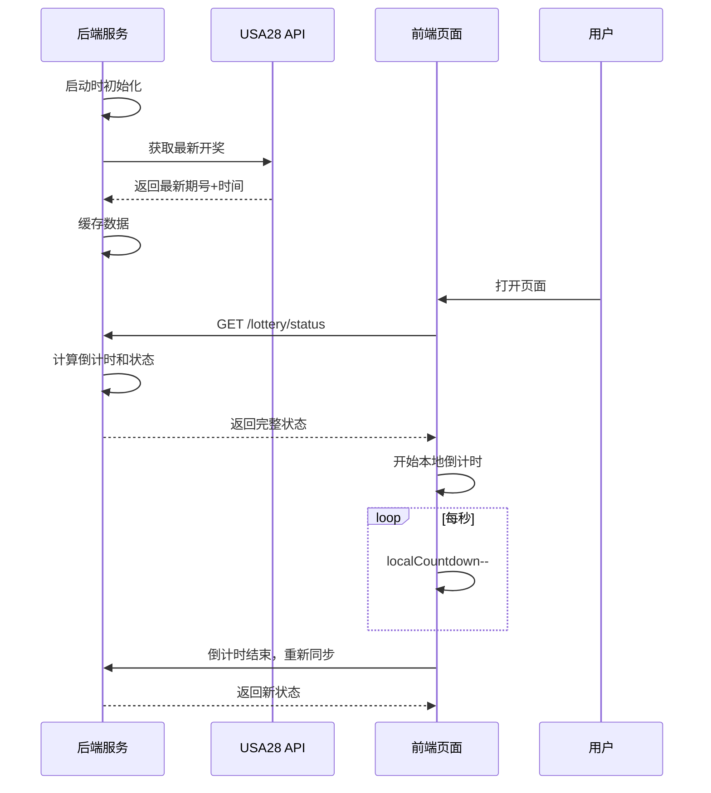
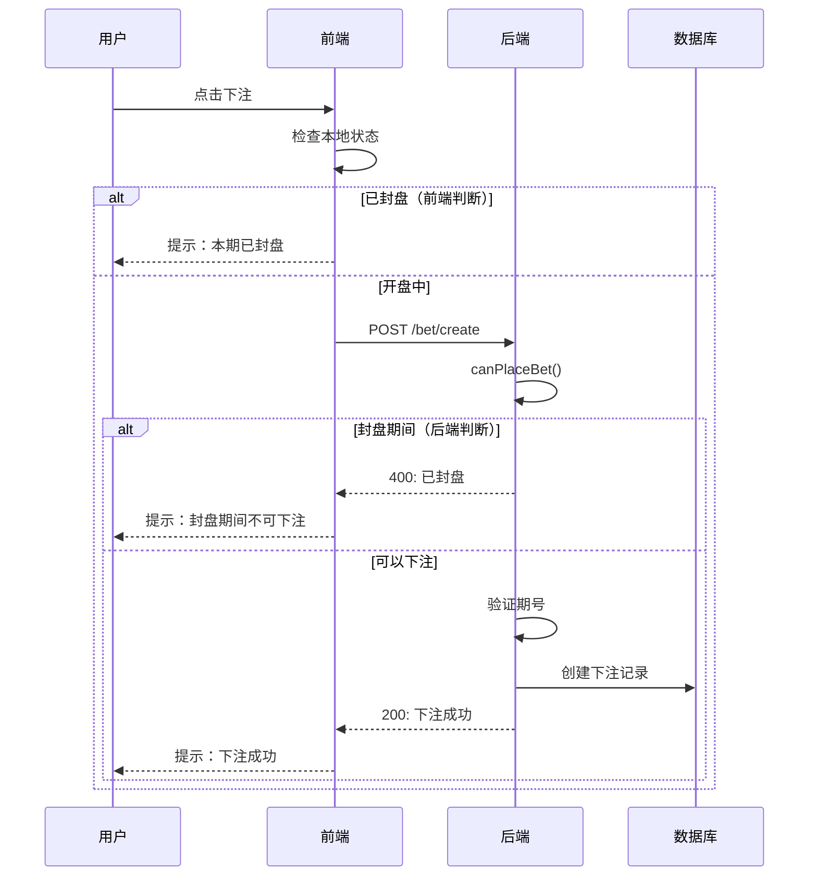

# 🎰 封盘倒计时系统说明

## 📋 系统概述

基于 **USA28 彩票**（每 3.5 分钟一期）的封盘倒计时系统，**后端控制核心业务逻辑，前端负责展示**。

---

## 🎯 核心设计原则

### ✅ 后端职责（权威）
1. **时间计算** - 所有时间计算在服务器端完成
2. **状态判定** - 判断开盘/封盘/即将封盘状态
3. **下注控制** - 封盘期间拒绝下注请求
4. **数据同步** - 定时从 USA28 API 获取最新开奖

### ✅ 前端职责（展示）
1. **倒计时显示** - 流畅的倒计时动画
2. **状态展示** - 可视化显示当前状态
3. **用户提示** - 封盘/开盘通知
4. **本地优化** - 减少服务器请求压力

---

## ⚙️ 技术参数

### 时间配置
```typescript
开奖间隔: 210秒 (3分30秒)
封盘时间: 开奖前30秒
警告时间: 封盘前60秒
开盘时间: 180秒 (210 - 30)
```

### 状态定义
```typescript
type Status = 'open' | 'closing' | 'closed'

- open: 正常开盘，可以下注
- closing: 即将封盘（封盘前60秒），仍可下注但需提示
- closed: 已封盘，不可下注
```

---

## 🏗️ 系统架构

### 后端架构

#### 1. LotteryCountdownService（核心服务）

**职责：**
- 管理开奖数据缓存
- 计算倒计时和状态
- 提供查询接口

**关键方法：**

```typescript
@Injectable()
export class LotteryCountdownService {
  // 配置
  private readonly DRAW_INTERVAL = 210;
  private readonly CLOSE_BEFORE_DRAW = 30;
  private readonly WARNING_TIME = 60;
  
  // 缓存
  private currentPeriod: string;
  private lastDrawTime: Date;
  
  // 初始化
  async initialize() {
    await this.fetchLatestDraw();
  }
  
  // 定时任务：每分钟同步一次数据
  @Cron(CronExpression.EVERY_MINUTE)
  async syncLatestDraw() {
    await this.fetchLatestDraw();
  }
  
  // 获取当前状态
  async getLotteryStatus(): Promise<LotteryStatusDto> {
    // 计算倒计时
    // 判断状态
    // 返回完整状态信息
  }
  
  // 检查是否可以下注
  async canPlaceBet(): Promise<{canBet: boolean, reason?: string}> {
    const status = await this.getLotteryStatus();
    return { canBet: status.canBet };
  }
}
```

#### 2. BetService（下注服务增强）

**增强点：**
```typescript
async createBet(userId: number, createBetDto: CreateBetDto) {
  // 1. 验证游戏是否开启
  // 2. ✨ 检查是否在封盘期间
  const betCheck = await this.countdownService.canPlaceBet();
  if (!betCheck.canBet) {
    throw new BadRequestException(betCheck.reason);
  }
  
  // 3. ✨ 验证下注期号是否为当前期
  const status = await this.countdownService.getLotteryStatus();
  if (issue !== status.currentPeriod) {
    throw new BadRequestException('下注期号错误');
  }
  
  // 4. 其他验证...
  // 5. 创建下注记录
}
```

#### 3. API 接口

| 接口 | 方法 | 说明 | 权限 |
|------|------|------|------|
| `/lottery/status` | GET | 获取彩票状态 | 公开 |
| `/lottery/can-bet` | GET | 检查是否可下注 | 公开 |
| `/lottery/refresh-status` | POST | 手动刷新状态 | 管理员 |

---

### 前端架构

#### 1. LotteryCountdown 组件

**优化策略：本地倒计时 + 定时同步**

```vue
<script setup lang="ts">
// 状态
const lotteryStatus = ref<LotteryStatusResponse | null>(null)
const localCountdown = ref(0) // 本地倒计时
const serverTimeDiff = ref(0) // 时间差校准

// 同步服务器状态
const fetchLotteryStatus = async () => {
  const res = await getLotteryStatus()
  
  // 计算服务器时间差
  const serverTime = new Date(res.data.serverTime).getTime()
  serverTimeDiff.value = serverTime - Date.now()
  
  // 初始化本地倒计时
  localCountdown.value = res.data.countdown
  lotteryStatus.value = res.data
}

// 本地倒计时更新
const updateLocalCountdown = () => {
  localCountdown.value = Math.max(0, localCountdown.value - 1)
  
  // ⏰ 倒计时结束，重新同步
  if (localCountdown.value <= 0) {
    fetchLotteryStatus()
  }
  
  // 🔄 每60秒校准一次（防止时间偏移）
  if (localCountdown.value % 60 === 0) {
    fetchLotteryStatus()
  }
}

// 启动
onMounted(async () => {
  await fetchLotteryStatus() // 首次同步
  setInterval(updateLocalCountdown, 1000) // 每秒更新
})
</script>
```

**同步时机：**
1. ✅ 组件挂载时 - 立即同步
2. ✅ 倒计时结束时 - 自动同步
3. ✅ 每60秒 - 定时校准
4. ✅ 手动刷新 - 用户触发

---

## 🔄 工作流程

### 系统启动流程



### 下注流程（封盘控制）



---

## 📊 状态响应示例

### GET /lottery/status 响应

```json
{
  "currentPeriod": "3364685",
  "nextPeriod": "3364686",
  "status": "open",
  "canBet": true,
  "countdown": 165,
  "countdownText": "距离封盘还有 2 分 45 秒",
  "lastDrawTime": "2025-11-27 04:11:30",
  "nextDrawTime": "2025-11-27 04:15:00",
  "progressPercentage": 8.33,
  "serverTime": "2025-11-27 04:12:45"
}
```

### 状态变化示例

| 倒计时 | status | canBet | countdownText |
|--------|--------|--------|---------------|
| 180秒 | open | true | 距离封盘还有 3 分 0 秒 |
| 60秒 | closing | true | ⚠️ 即将封盘，还有 60 秒 |
| 30秒 | closed | false | 距离开奖还有 30 秒 |
| 0秒 | - | - | 重新获取状态 |

---

## 🔒 安全机制

### 1. 双重验证
```typescript
// 前端：快速反馈
if (localCountdown <= 0) {
  ElMessage.warning('本期已封盘')
  return
}

// 后端：权威验证（必须）
const betCheck = await countdownService.canPlaceBet()
if (!betCheck.canBet) {
  throw new BadRequestException(betCheck.reason)
}
```

### 2. 期号验证
```typescript
// 防止用户提交旧期号或未来期号
if (issue !== lotteryStatus.currentPeriod) {
  throw new BadRequestException('下注期号错误')
}
```

### 3. 时间校准
```typescript
// 前端计算服务器时间差
serverTimeDiff = serverTime - clientTime

// 每60秒校准一次
if (localCountdown % 60 === 0) {
  fetchLotteryStatus()
}
```

---

## 🎨 UI 展示

### 状态颜色
```scss
.status-open {
  background: #f0f9ff;
  color: #67c23a;
  border: 2px solid #67c23a;
}

.status-warning {
  background: #fdf6ec;
  color: #e6a23c;
  border: 2px solid #e6a23c;
  animation: pulse 1s infinite; // 闪烁提示
}

.status-closed {
  background: #fef0f0;
  color: #f56c6c;
  border: 2px solid #f56c6c;
}
```

### 进度条颜色
- 开盘中：绿色 `#67c23a`
- 即将封盘：橙色 `#e6a23c`
- 已封盘：红色 `#f56c6c`

---

## 📱 使用示例

### 1. 在页面中使用

```vue
<template>
  <LotteryCountdown 
    @close="handleClose"
    @open="handleOpen"
    @tick="handleTick"
  />
</template>

<script setup>
import LotteryCountdown from '@/components/LotteryCountdown.vue'

const handleClose = (data) => {
  console.log('封盘了', data)
  // 禁用下注按钮
}

const handleOpen = (data) => {
  console.log('开盘了', data)
  // 启用下注按钮
}

const handleTick = (countdown) => {
  // 每秒更新
}
</script>
```

### 2. 程序化调用

```typescript
import { getLotteryStatus, canPlaceBet } from '@/api/lottery'

// 获取状态
const status = await getLotteryStatus()
console.log('当前期号:', status.data.currentPeriod)
console.log('可否下注:', status.data.canBet)

// 检查是否可下注
const check = await canPlaceBet()
if (!check.data.canBet) {
  ElMessage.warning(check.data.reason)
}
```

---

## 🔧 性能优化

### 1. 减少网络请求

**优化前：** 每秒请求一次后端 → ❌ 1800次/期
**优化后：** 倒计时结束+每60秒 → ✅ 4次/期

**减少压力：** 99.8% ↓

### 2. 缓存策略

```typescript
// 后端缓存最新开奖数据
private currentPeriod: string
private lastDrawTime: Date

// 每分钟刷新一次（定时任务）
@Cron(CronExpression.EVERY_MINUTE)
async syncLatestDraw() {
  await this.fetchLatestDraw()
}
```

### 3. 响应速度

| 操作 | 优化前 | 优化后 |
|------|--------|--------|
| 倒计时更新 | ~100ms (网络) | <1ms (本地) |
| 状态查询 | ~100ms | ~100ms |
| 下注验证 | ~200ms | ~200ms |

---

## 🐛 故障处理

### 问题1：倒计时不准确

**原因：** 客户端时间与服务器时间不一致

**解决：**
```typescript
// 计算时间差并校准
const serverTime = new Date(res.data.serverTime).getTime()
serverTimeDiff.value = serverTime - Date.now()

// 每60秒校准一次
if (localCountdown.value % 60 === 0) {
  fetchLotteryStatus()
}
```

### 问题2：封盘期间仍可下注

**原因：** 只在前端验证

**解决：**
```typescript
// 后端强制验证（必须）
const betCheck = await this.countdownService.canPlaceBet()
if (!betCheck.canBet) {
  throw new BadRequestException(betCheck.reason)
}
```

### 问题3：倒计时卡顿

**原因：** 每秒请求后端

**解决：**
```typescript
// 本地倒计时，定时同步
setInterval(() => {
  localCountdown.value-- // 本地更新
}, 1000)
```

---

## 📈 监控指标

### 关键指标
1. **API响应时间** - `/lottery/status` < 100ms
2. **同步频率** - 每期 ~4次
3. **错误率** - < 0.1%
4. **时间偏差** - < 1秒

### 日志记录
```typescript
console.log('✓ 同步服务器状态:', {
  期号: newStatus.currentPeriod,
  状态: newStatus.status,
  倒计时: newStatus.countdown + '秒',
  服务器时间差: (serverTimeDiff.value / 1000).toFixed(1) + '秒',
})
```

---

## 🚀 部署注意事项

### 1. 时区设置
```bash
# 确保服务器时区正确
TZ=Asia/Shanghai
```

### 2. 定时任务
```typescript
// NestJS 需要启用调度模块
@Module({
  imports: [ScheduleModule.forRoot()],
})
```

### 3. 数据库索引
```sql
-- 优化期号查询
CREATE INDEX idx_issue ON lottery_result(issue);
CREATE INDEX idx_bet_issue_user ON bets(issue, user_id);
```

---

## 📚 相关文档

- [USA28 API 接口文档](../开奖数据源接口测试报告.md)
- [开奖数据同步指南](./开奖数据同步指南.md)
- [用户下注流程文档](./用户下注流程.md)

---

**更新时间：** 2025-11-27  
**版本：** v1.0 - 后端控制版本  
**作者：** AI Assistant


