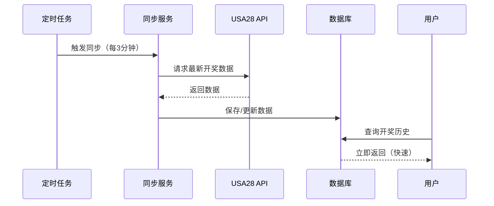

# 开奖数据定时同步方案 🔄

## 📋 方案概述

采用**后台定时任务主动同步**的架构，替代原来的"前端请求时被动获取"方案。

### 核心思想

> **数据库作为唯一数据源，定时任务负责保持数据库与第三方API同步**

```
第三方API (USA28) 
    ↓ 
定时任务自动同步 (每3分钟)
    ↓
数据库 (MySQL)
    ↓
前端请求 (直接查数据库，速度快)
```

---

## 🎯 方案优势

### ✅ 1. 性能优化
- **前端查询速度快**：直接查数据库，无需等待第三方API响应
- **响应时间稳定**：不受第三方API网络波动影响
- **降低延迟**：数据库本地查询 < 50ms，API请求通常 > 500ms

### ✅ 2. 用户体验提升
- **无感知加载**：用户看到的数据立即显示，无加载等待
- **界面流畅**：不会因为API慢导致页面卡顿
- **数据一致性**：所有用户看到的数据保持一致

### ✅ 3. 可靠性增强
- **容错能力强**：即使某次API调用失败，不影响用户查询
- **数据持久化**：所有历史数据永久保存在数据库
- **故障恢复**：API恢复后，定时任务会自动补齐缺失数据

### ✅ 4. 降低API压力
- **减少调用频率**：每3分钟同步1次，而不是每次请求都调用
- **避免重复请求**：多用户并发查询不会导致重复API调用
- **符合API最佳实践**：避免被第三方限流或封禁

### ✅ 5. 维护性提升
- **逻辑集中**：数据同步逻辑集中在后端定时任务
- **易于调试**：清晰的日志记录每次同步结果
- **灵活控制**：可以随时调整同步频率和策略

---

## 🔧 技术实现

### 核心组件

#### 1. **定时同步服务** (`lottery-sync.service.ts`)

```typescript
@Injectable()
export class LotterySyncService {
  // 每3分钟执行一次
  @Cron('*/3 * * * *')
  async handleScheduledSync() {
    await this.syncLotteryData();
  }

  // 每30秒检查是否有新期
  @Cron('*/30 * * * * *')
  async checkNewIssue() {
    // 检测到新期立即同步
  }
}
```

**功能**：
- ⏰ 每3分钟自动同步一次
- 🎲 检测到新期开奖立即同步
- 🚀 应用启动后5秒首次同步
- 🔒 防并发控制（同时只运行一个同步任务）

#### 2. **开奖服务** (`lottery.service.ts`)

```typescript
// 直接从数据库查询
async getLotteryHistory(query: QueryLotteryDto) {
  return this.prisma.lotteryResult.findMany({
    where,
    orderBy: { drawTime: 'desc' },
  });
}

// 同步数据到数据库
async syncLotteryData() {
  // 调用USA28 API
  // 解析数据
  // 保存到数据库
}
```

**职责**：
- 📡 调用第三方API获取数据
- 💾 保存/更新数据库
- 🔍 提供查询接口

#### 3. **倒计时服务** (`lottery-countdown.service.ts`)

```typescript
@Injectable()
export class LotteryCountdownService {
  // 获取当前期号
  async getLotteryStatus() { }
  
  // 判断是否可以下注（封盘检测）
  async canPlaceBet() { }
}
```

**职责**：
- ⏱️ 计算开奖倒计时
- 🔐 判断是否在封盘期
- 🎯 提供当前期号信息

---

## 📊 同步策略

### 定时任务时间表

| 定时任务 | 执行频率 | Cron表达式 | 说明 |
|---------|---------|-----------|------|
| 常规同步 | 每3分钟 | `*/3 * * * *` | 与开奖周期一致 |
| 新期检测 | 每30秒 | `*/30 * * * * *` | 快速响应新期 |
| 应用启动 | 启动后5秒 | - | 确保初始数据 |

### 数据流程



---

## 🛡️ 容错机制

### 1. API失败处理

```typescript
try {
  const result = await this.lotteryService.syncLotteryData();
  this.logger.log(`✅ 同步成功: ${result.syncedCount} 条`);
} catch (error) {
  this.logger.error(`❌ 同步失败: ${error.message}`);
  // 不抛出错误，下次继续尝试
}
```

**策略**：
- ❌ 单次失败不影响系统运行
- 🔄 下次定时任务会自动重试
- 📝 记录错误日志供排查

### 2. 数据去重

```typescript
await this.prisma.lotteryResult.upsert({
  where: { issue: drawIssue },
  update: lotteryData,
  create: lotteryData,
});
```

**策略**：
- 🔑 使用期号作为唯一标识
- 🔄 重复数据自动更新
- ✅ 避免数据重复

### 3. 并发控制

```typescript
private isSyncing: boolean = false;

private async syncLotteryData() {
  if (this.isSyncing) {
    return; // 跳过本次
  }
  this.isSyncing = true;
  try {
    // 执行同步
  } finally {
    this.isSyncing = false;
  }
}
```

**策略**：
- 🔒 同时只运行一个同步任务
- ⏭️ 并发请求自动跳过
- ✅ 避免资源浪费

---

## 📡 API接口

### 用户接口

| 接口 | 方法 | 路径 | 说明 |
|-----|------|-----|------|
| 开奖历史 | GET | `/api/lottery/history` | 查询数据库 |
| 当前期号 | GET | `/api/lottery/current` | 查询数据库 |
| 倒计时状态 | GET | `/api/lottery/status` | 实时计算 |

### 管理员接口

| 接口 | 方法 | 路径 | 说明 |
|-----|------|-----|------|
| 手动同步 | POST | `/api/lottery/sync` | 立即触发同步 |
| 同步状态 | GET | `/api/lottery/sync-status` | 查看同步状态 |
| 测试API | GET | `/api/lottery/test-api` | 测试第三方API |

---

## 🎮 使用示例

### 前端查询开奖历史

```typescript
// 简单、快速
const { data } = await axios.get('/api/lottery/history', {
  params: { page: 1, limit: 20 }
});

// 响应速度：< 50ms
// 数据来源：数据库
```

### 管理员手动同步

```typescript
// 管理后台触发
const { data } = await axios.post('/api/lottery/sync');

// 响应：{ message: '同步任务已触发' }
```

### 查看同步状态

```typescript
const { data } = await axios.get('/api/lottery/sync-status');

// 响应：
// {
//   isSyncing: false,
//   lastSyncedIssue: '3330421'
// }
```

---

## 📈 性能对比

### 旧方案（被动同步）

```
用户请求 → 检查数据库 → 调用API → 解析数据 → 保存数据库 → 返回
响应时间：500ms - 3000ms（取决于API速度）
```

### 新方案（定时同步）

```
用户请求 → 查询数据库 → 返回
响应时间：20ms - 50ms（稳定）
```

**性能提升**：**10倍 - 100倍** 🚀

---

## 🔍 监控与日志

### 日志示例

```
[LotterySyncService] 🚀 开奖数据定时同步服务已启动
[LotterySyncService] ⏰ 定时任务触发：开始同步开奖数据
[LotterySyncService] 📡 开始同步开奖数据...
[LotteryService] 请求USA28 API: https://api.365kaik.com/...
[LotteryService] ✓ 成功保存期号 3330421: 1+2+3=6
[LotterySyncService] ✅ 同步成功！新增 10 条数据，最新期号: 3330421
[LotterySyncService] 🎲 检测到新期开奖！期号: 3330422
```

### 监控指标

- ✅ 同步成功率
- ⏱️ 同步耗时
- 📊 数据量统计
- ❌ 失败次数和原因

---

## ⚙️ 配置调整

### 修改同步频率

```typescript
// lottery-sync.service.ts

// 改为每分钟同步
@Cron('* * * * *')

// 改为每5分钟同步
@Cron('*/5 * * * *')

// 改为每小时同步
@Cron('0 * * * *')
```

### 禁用定时任务

```typescript
// app.module.ts
// 注释掉 ScheduleModule 即可
// ScheduleModule.forRoot(),
```

---

## 🎯 总结

### 核心价值

1. **用户体验** → 查询速度提升 10倍以上
2. **系统稳定性** → API故障不影响用户
3. **数据可靠性** → 所有数据永久保存
4. **维护性** → 逻辑清晰，易于调试
5. **扩展性** → 方便添加新的数据源

### 适用场景

✅ 需要展示历史数据  
✅ 第三方API响应慢  
✅ 多用户并发访问  
✅ 对数据一致性有要求  
✅ 需要离线查询能力

---

## 📚 相关文档

- [开奖数据源接口测试报告.md](../开奖数据源接口测试报告.md)
- [开奖数据采集算法详解.md](../开奖数据采集算法详解.md)
- [开奖数据同步指南.md](./开奖数据同步指南.md)
- [启动指南.md](./启动指南.md)

---

**🎉 定时同步方案已完成并启用！**

**下次启动后端服务时，定时任务会自动运行，每3分钟同步一次开奖数据。**


