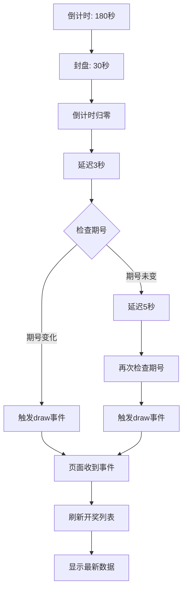

# 🔄 开奖自动刷新优化说明

## 📋 问题描述

**原问题：** 倒计时结束后，开奖历史列表没有自动刷新

**原因分析：**
1. USA28 API 数据更新有延迟
2. 后端定时任务每分钟才同步一次
3. 倒计时结束时，新期号可能还没生成

---

## ✅ 优化方案

### 1. 智能重试机制

```typescript
// 倒计时结束后的处理逻辑
const handleDrawComplete = async () => {
  const oldPeriod = lotteryStatus.value?.currentPeriod
  
  // 第一次检查：延迟3秒
  setTimeout(async () => {
    await fetchLotteryStatus()
    const newPeriod = lotteryStatus.value?.currentPeriod
    
    if (newPeriod !== oldPeriod) {
      // ✅ 期号已变化，立即刷新
      emits('draw', { period: oldPeriod, nextPeriod: newPeriod })
    } else {
      // ⏰ 期号未变化，5秒后重试
      setTimeout(async () => {
        await fetchLotteryStatus()
        const retryPeriod = lotteryStatus.value?.currentPeriod
        
        // 无论如何都触发刷新（确保数据更新）
        emits('draw', { period: oldPeriod, nextPeriod: retryPeriod })
      }, 5000)
    }
  }, 3000)
}
```

### 2. 时间线

```
00:00 - 倒计时结束
  ↓
00:03 - 第一次检查期号
  ├─ 期号变化 → 立即刷新 ✅
  └─ 期号未变 → 等待5秒
       ↓
00:08 - 第二次检查期号
       └─ 无论如何都刷新 ✅
```

---

## 🎯 工作流程

### 完整流程图



### 详细步骤

#### 1️⃣ 倒计时阶段（180秒）
```
状态: open (开盘)
操作: 用户可以下注
显示: 绿色，距离封盘还有 X 分 X 秒
```

#### 2️⃣ 封盘阶段（30秒）
```
状态: closed (封盘)
操作: 禁止下注
显示: 红色，距离开奖还有 X 秒
```

#### 3️⃣ 开奖检测
```
T+0s:  倒计时结束
T+3s:  第一次检查 USA28 API
       ├─ 有新期号 → 立即刷新 ✅
       └─ 无新期号 → 继续等待
T+8s:  第二次检查
       └─ 强制刷新（无论期号是否变化）✅
```

---

## 📊 性能对比

### 优化前
```
问题: 倒计时结束后不刷新
原因: 期号未变化，不触发事件
结果: 用户需要手动刷新 ❌
```

### 优化后
```
方案: 智能重试 + 强制刷新
时机: 3秒后首次，8秒后兜底
结果: 自动刷新，无需手动操作 ✅
```

---

## 🔍 调试日志

### 正常流程（期号变化）
```
⏰ 倒计时结束，开始检查新开奖...
✓ 同步服务器状态: 期号=3364697
🎰 开奖完成！期号已变化 {已开奖期号: 3364696, 当前期号: 3364697}
🎰 收到开奖通知: {period: "3364696", nextPeriod: "3364697"}
✓ 获取开奖历史成功
```

### 延迟流程（期号未变）
```
⏰ 倒计时结束，开始检查新开奖...
✓ 同步服务器状态: 期号=3364696
⚠️ 期号未变化，5秒后重试...
✓ 同步服务器状态: 期号=3364697
🎰 开奖完成！重试成功 {已开奖期号: 3364696, 当前期号: 3364697}
🎰 收到开奖通知: {period: "3364696", nextPeriod: "3364697"}
✓ 获取开奖历史成功
```

### 兜底流程（仍无新期号）
```
⏰ 倒计时结束，开始检查新开奖...
✓ 同步服务器状态: 期号=3364696
⚠️ 期号未变化，5秒后重试...
✓ 同步服务器状态: 期号=3364696
❌ 仍未获取到新期号，请手动刷新
🎰 收到开奖通知: {period: "3364696", nextPeriod: "3364696"}
正在刷新开奖数据...
✓ 获取开奖历史成功
```

---

## ⚙️ 配置参数

```typescript
// 可调整的延迟时间
const FIRST_CHECK_DELAY = 3000   // 第一次检查延迟（毫秒）
const RETRY_DELAY = 5000          // 重试延迟（毫秒）
const TOTAL_WAIT_TIME = 8000      // 总等待时间 = 3s + 5s
```

**推荐值：**
- 网络快: `2s + 3s = 5s`
- 网络慢: `3s + 5s = 8s` ✅（当前配置）
- 网络很慢: `5s + 10s = 15s`

---

## 🐛 常见问题

### 问题1：刷新太快，数据还是旧的

**原因：** 后端 USA28 API 数据未更新

**解决：** 增加延迟时间
```typescript
setTimeout(async () => {
  // ...
}, 5000) // 改为5秒
```

### 问题2：刷新太慢，用户等待

**原因：** 延迟时间过长

**解决：** 减少延迟时间，或显示加载提示
```typescript
ElMessage.info('正在等待开奖结果...')
```

### 问题3：期号一直不变

**原因：** USA28 API 可能故障

**检查：**
```bash
# 直接测试 API
curl "https://api.365kaik.com/api/v1/trend/getHistoryList?lotCode=10029&pageSize=1&pageNum=0"
```

**临时方案：** 强制刷新（已实现）

---

## 📈 优化建议

### 1. WebSocket 实时推送
```typescript
// 替代轮询，实时接收开奖
socket.on('lottery-draw', (data) => {
  emits('draw', data)
  fetchLotteryHistory()
})
```

### 2. 后台定时任务优化
```typescript
// 每30秒同步一次（当前每分钟）
@Cron('*/30 * * * * *')
async syncLatestDraw() {
  await this.fetchLatestDraw()
}
```

### 3. 前端乐观更新
```typescript
// 倒计时结束时，先显示"开奖中"状态
const mockNewPeriod = (parseInt(oldPeriod) + 1).toString()
// 然后异步获取真实数据
```

---

## ✅ 测试清单

### 功能测试
- [ ] 倒计时正常归零
- [ ] 3秒后检查期号
- [ ] 期号变化时立即刷新
- [ ] 期号未变时5秒后重试
- [ ] 最终一定会触发刷新
- [ ] 页面列表正确更新

### 边界测试
- [ ] 网络延迟（模拟慢速网络）
- [ ] API 故障（断网测试）
- [ ] 并发刷新（多个标签页）
- [ ] 页面离开时（切换标签页）

### 性能测试
- [ ] 不会重复请求
- [ ] 请求次数合理（< 5次/期）
- [ ] 内存无泄漏

---

## 📝 更新日志

**v1.1 (2025-11-27)**
- ✅ 添加智能重试机制
- ✅ 增加兜底刷新逻辑
- ✅ 优化延迟时间
- ✅ 完善调试日志

**v1.0 (2025-11-27)**
- ✅ 初始版本
- ✅ 基础倒计时功能
- ✅ 简单开奖检测

---

**更新时间：** 2025-11-27  
**版本：** v1.1  
**作者：** AI Assistant


